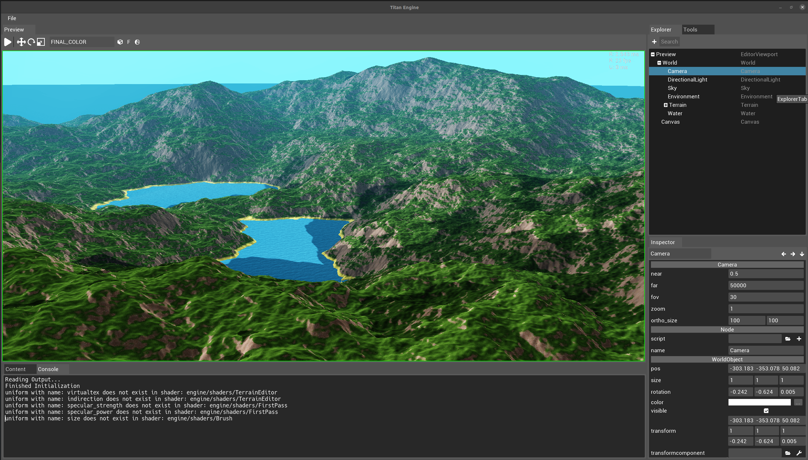

# Titan Engine

A graphics engine using OpenGL and written in C++.

Preview of the editor:


Features:
  - A scripting language, TitanScript, which is fully integrated on a low level into the engine
  - Editor
  - UI system
  - 2D and 3D support

Libraries used:
  - SDL 2.0 (including SDL_image, SDL_mixer and SDL_ttf)
  - Box2D
  - Bullet
  - LibNoise
  - Assimp
  - Glew
  - Freeglut
  - RapidXML
  - FontAwesome

3D graphics features:
  - Deferred Renderer
  - GPU tesselation
  - Basic lighting and shadowmapping
  - Terrain and water
  - Godrays and lens flare
  - Terrain heightmap editing on GPU

# Building
Building has been tested on Linux. Windows and Mac OS X are not supported at the moment.

## Linux
Building on Linux is possible using CMake. First, make sure that the above libraries are installed. On Debian-based systems, this command can be used:

```bash
sudo apt install cmake librapidxml-dev libglew-dev libassimp-dev libnoise-dev libbullet-dev libbox2d-dev \
  libsdl2-mixer-dev libsdl2-image-dev libsdl2-ttf-dev libsdl2-image-2.0-0 libsdl2-dev
```

When the libraries are installed, clone and build the project:
```bash
git clone git@github.com:evroon/titan.git
cd titan/src
cmake ./
cmake --build . -- -j8
```

Where the `-j` flag indicates the number of jobs, which is ideally at least as high as the number of cores of your CPU.
