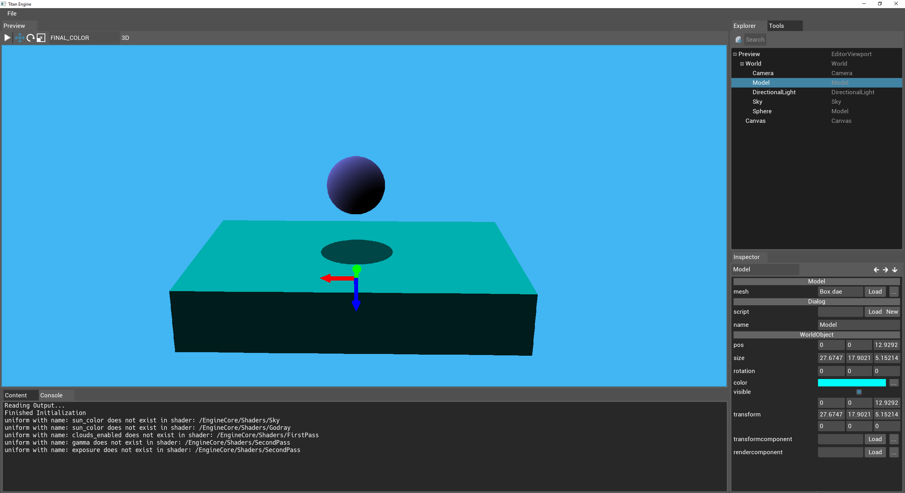

# Titan-Designer

A multi-platform game engine using OpenGL and written in c++.

Example of the editor:

Features:
  - A scripting language, TitanScript, which is fully integrated on a low level into the engine
  - Editor
  - UI system
  - 2D and 3D support
  - Designed to build on Windows, Linux, Mac OS X and Android

Libraries used:
  - SDL 2.0 (including SDL_image, SDL_mixer and SDL_ttf)
  - Box2D
  - Bullet
  - LibNoise
  - Assimp
  - Glew
  - Freeglut
  - RapidXML

3D graphics features:
  - Deferred Renderer
  - GPU tesselation
  - Basic lighting and shadowmapping
  - Terrain and water
  - Godrays and lens flare
  - Terrain heightmap editing on GPU
  - Virtual textures (not yet adaptive virtual textures)

# Installation
The project can be build using Visual Studio.
Unfortunately, building on Linux or Mac is not supported yet.
